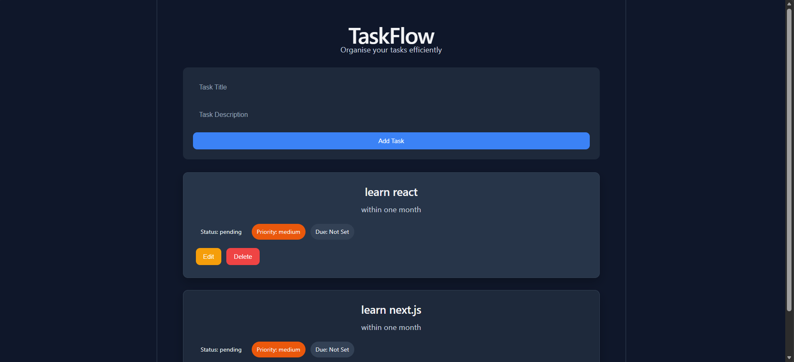
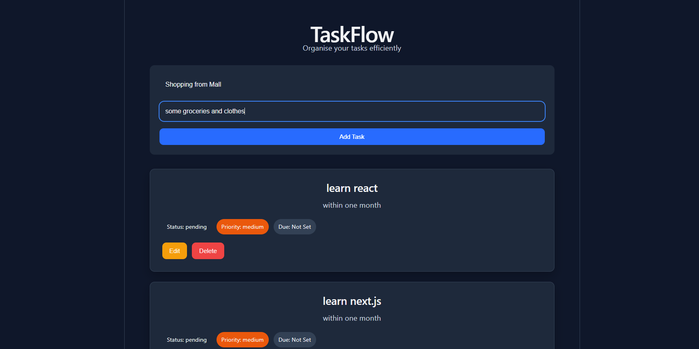
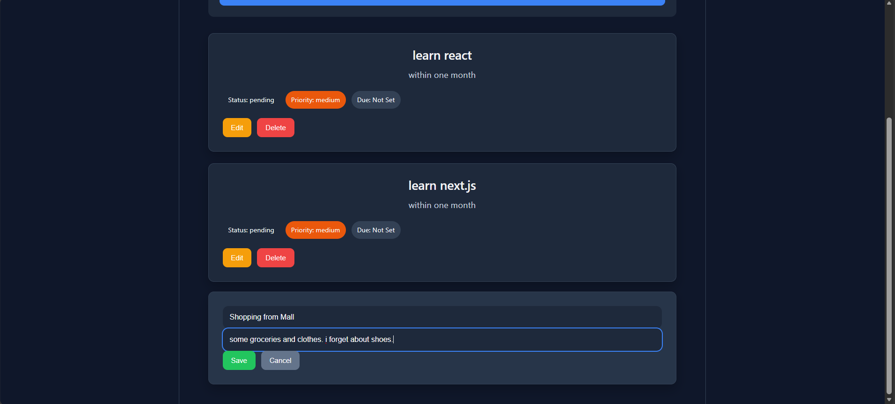
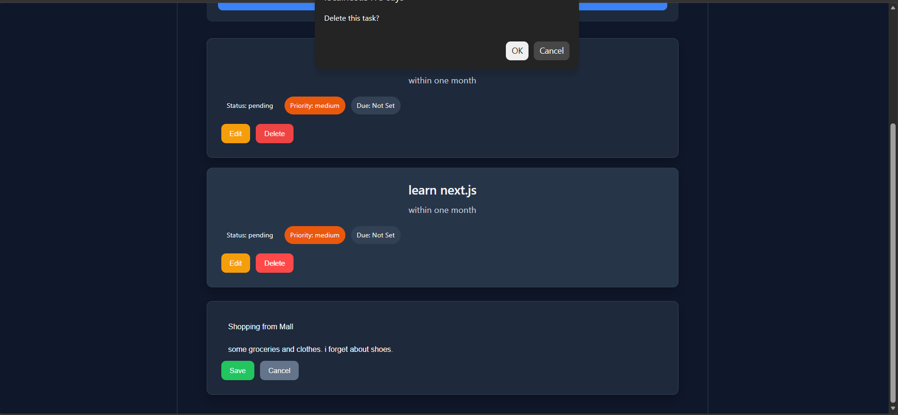

# TaskFlow

TaskFlow is a full-stack MERN (MongoDB, Express.js, React, Node.js) task management application that helps users organize and manage their daily tasks efficiently. It supports complete CRUD operations with a modern, responsive user interface.


## 📌 Project Overview

TaskFlow is a simple and responsive task management application that allows users to manage daily tasks efficiently using CRUD operations. The application follows the MERN architecture and stores task data in MongoDB.


---

## 🚀 Features

- Create new tasks
- View all tasks
- Update existing tasks
- Delete tasks with confirmation
- Responsive user interface
- Modern dark theme using CSS Variables
- Form validation
- Loading and error handling
- Display task status, priority, and due date
- RESTful API integration with MongoDB

---

## 🛠️ Tech Stack

### Frontend
- React
- JavaScript (ES6+)
- CSS3
- Fetch API

### Backend
- Node.js
- Express.js

### Database
- MongoDB
- Mongoose

### Development Tools
- Git
- GitHub
- VS Code
- Postman

---


## 🏗️ Architecture

```
React Frontend
      │
      ▼
REST API (Express.js)
      │
      ▼
MongoDB Database
```

---
## 📡 API Endpoints

| Method | Endpoint | Description |
|---------|----------|-------------|
| GET | /api/tasks | Get all tasks |
| GET | /api/tasks/:id | Get a single task |
| POST | /api/tasks | Create a task |
| PUT | /api/tasks/:id | Update a task |
| DELETE | /api/tasks/:id | Delete a task |

---

## 📂 Project Structure

```
TaskFlow
│
├── client
│   ├── public
│   ├── src
│   └── package.json
│
├── server
│   ├── config
│   ├── controllers
│   ├── models
│   ├── routes
│   ├── .env
│   └── server.js
│
├── .gitignore
└── README.md
```

---

## ⚙️ Installation

### Clone the repository

```bash
git clone https://github.com/Shankychauhan1902/TaskFlow.git
```

### Install frontend dependencies

```bash
cd client
npm install
```

### Install backend dependencies

```bash
cd ../server
npm install
```

---

## 🔐 Environment Variables

Create a `.env` file inside the **server** folder.

```env
MONGO_URI=your_mongodb_connection_string
```

---

## ▶️ Run the Backend

```bash
cd server
npm run dev
```

---

## ▶️ Run the Frontend

```bash
cd client
npm run dev
```

---

## 📸 Application Screenshots






---

##  Future Improvements

- Search tasks by title
- Filter tasks by status
- Sort tasks by priority
- Add user authentication
- Drag and drop task management
- Toast notifications
- Light/Dark mode switch
- Deploy frontend and backend
---

## 📄 License

This project is developed for learning and portfolio purposes.

---

## 📚 Key Learning Outcomes

During this project I learned:

- React Hooks (`useState`, `useEffect`)
- REST API integration
- CRUD operations
- Express.js
- MongoDB with Mongoose
- State management
- Responsive UI design
- Git and GitHub workflow

---

##  Author

Sankit Chauhan

---

---

⭐ If you found this project helpful or interesting, feel free to give it a star on GitHub.